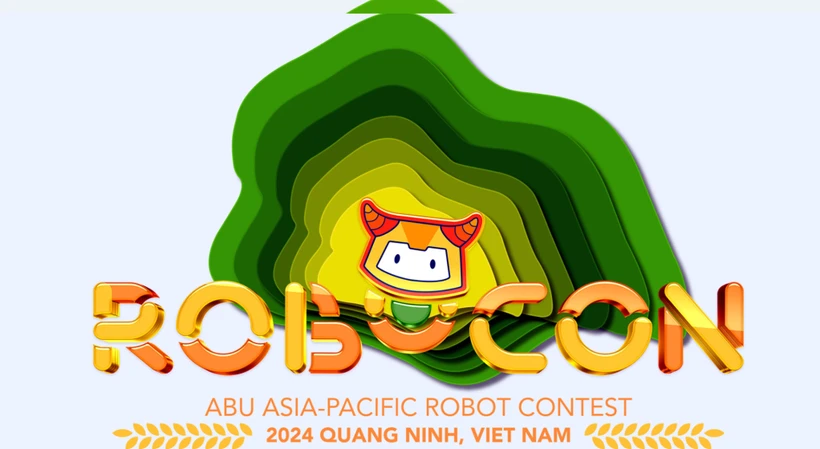

#  ABU Robocon 2024 – Team Nepal



This repository contains the docker image for complete ROS 2 (Humble) workspace developed for the **ABU Robocon 2024** robotics competition held in **Quảng Ninh, Vietnam** 🇻🇳.


## Competition Theme – "Harvest Day"

In ABU Robocon 2024, teams are challenged with a vibrant agricultural scenario based on the theme **"Harvest Day"**.
The competition simulates a **Vietnamese rice harvest festival**, where two robots must cooperate autonomously and manually to:

- **Navigate a stylized rice paddy field**
- **Harvest rice balls placed at specific locations**
- **Deliver harvested balls into storage zone**
- **Stack rice balls storage zone into silos autonomously**
- **Complete all tasks in the shortest time possible**

Each match includes a **Harvesting Area**, **Collection Area**, and **Obstacles**.

 Official Info: [Explore Robocon 2024 Theme and Rules (VTV)](https://english.vtv.vn/news/explore-robocon-2024-theme-and-rules-20240509104353646.htm)


---

## Workspace Overview

- **ROS Distro**: Humble Hawksbill 🐢
- **Base Image**: Ubuntu 22.04
- **Key Tools**:
  - BehaviorTree.CPP (v3)
  - Nav2 Stack
  - Serial Communication
  - OAK-D DepthAI integration

...

## Included custom Packages
Following are the packages developed for autonomy of the robot.

| Package               | Description                                                        | Repository Link |
|-----------------------|--------------------------------------------------------------------|------------------|
| [`action_pkg`](packages/action_pkg/)            | Defines custom ROS 2 actions used across the system for asynchronous control flows. | [GitHub](https://github.com/kundanx/action_pkg) |
| [`behaviour_plugins`](packages/behaviour_plugins/) | Implements BehaviorTree.CPP v3 plugins, and includes shared C++/Python libraries (`robotlibpc`) for controllers, math, crypto, etc. | [GitHub](https://github.com/kundanx/behaviour_plugins) |
| [`dev_pi_communicate`](packages/dev_pi_communicate/) | Handles serial and telemetry communication between the robot and embedded devices like Raspberry Pi or STM32. | [GitHub](https://github.com/kundanx/dev_pi_communicate) |
| [`line_follower`](packages/line_follower/)     | Contains behavior logic, perception modules, and BT nodes for line following, including motor control over serial. | [GitHub](https://github.com/kundanx/line_follower) |
| [`oakd_msgs`](packages/oakd_msgs/)             | Defines custom ROS 2 message types used with the OAK-D DepthAI camera integration. | [GitHub](https://github.com/kundanx/oakd_msgs) |

For more technical details about each package's structure and usage, see [`docs/package_overview.md`](docs/package_overview.md).

---

## 🐳 Docker Setup (Development Environment)

To build and run the workspace using Docker:

```bash
git clone --recurse-submodules git@github.com:kundanx/robocon2024_ros_ws.git
cd robocon2024_ros2_ws
docker build -t robocon2024 .
docker run -it robocon2024